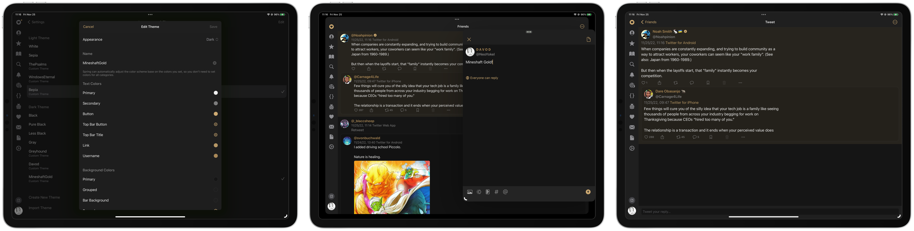
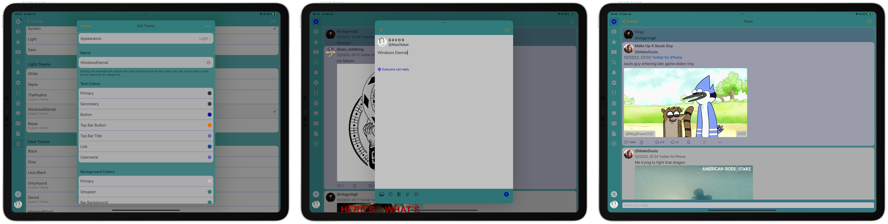

# Themes for S̵p̵r̵i̵n̵g̵ f̵o̵r̵ T̵w̵i̵t̵t̵e̵r̵ Mona for Mastodon (iOS/iPadOS/macOS)

## A collection of color themes originally developed for [Spring for Twitter](https://apps.apple.com/us/app/spring-for-twitter/id1508706541), but compatible with (and developed for, going forward) [**Mona for Mastodon**](https://mastodon.social/@MonaApp).

<iframe src="https://mastodon.social/@MonaApp/109859984571889210/embed" class="mastodon-embed" style="max-width: 100%; border: 0" width="400" allowfullscreen="allowfullscreen"></iframe>

## Dark

### Things

`mona-cat://8130`

### Mineshaft Gold

## Light

### Windows Eternal

`mona-cat://376a`

### Bepia

`mona-cat://6daa`